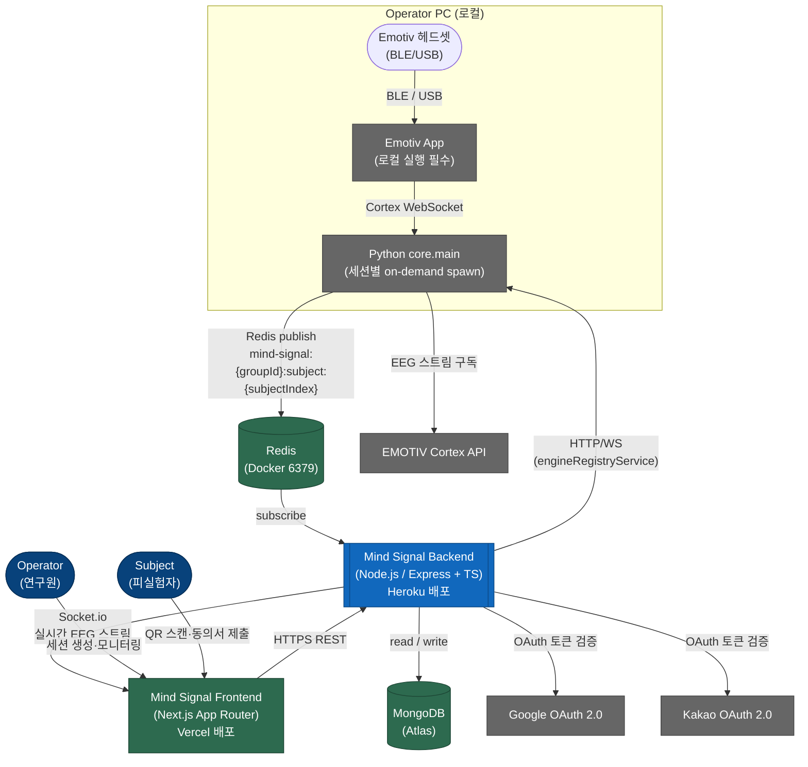

# Architecture Overview — System Context (C4 Level 1)

> **BE 관점의 시스템 컨텍스트 다이어그램.** 누가 시스템을 사용하고,
> 어떤 외부 시스템과 통신하는지를 보여줌. 프레임워크 명이나 DB 스키마
> 이름이 아닌 비즈니스 언어(`Operator`, `Subject`)로 기술함.

## One-line description

Mind Signal은 Emotiv EEG 헤드셋으로 피실험자의 뇌파를 실시간 수집·분석하여
연구자(Operator)에게 라이브 시각화 및 AI 분석 결과를 제공하는 뇌-컴퓨터 인터페이스 연구 플랫폼임.

## System context diagram

## Actors

| Actor | Type | 역할 |
|---|---|---|
| `Operator` | Person | PC에서 실험을 관리하는 연구원. QR 생성, EEG 라이브 차트 모니터링, 분석 결과 확인함 |
| `Subject` | Person | 모바일로 QR 스캔하여 참여하는 피실험자. EEG 측정 대상임 |

## External systems

| System | Direction | Purpose |
|---|---|---|
| `Emotiv App` | outbound (local) | Emotiv 헤드셋 BLE/USB 연결을 수신하여 Cortex WebSocket으로 스트림 제공함 |
| `EMOTIV Cortex API` | outbound | Python 엔진이 EEG 원시 데이터를 구독하는 Emotiv 공식 SDK WebSocket API |
| `Redis (Docker 6379)` | bidirectional | Python 엔진 → BE pub/sub 채널. 채널 키: `mind-signal:{groupId}:subject:{subjectIndex}` |
| `MongoDB Atlas` | outbound | 사용자, 세션, 설문, EEG 레코드, 분석 결과 영속 저장함 |
| `Google OAuth 2.0` | outbound | Operator / Subject 소셜 로그인 토큰 검증함 |
| `Kakao OAuth 2.0` | outbound | Operator / Subject 소셜 로그인 토큰 검증함 |
| `Vercel (FE 배포)` | inbound | Next.js App Router 프론트엔드 호스팅. BE에 HTTPS REST 요청 전송함 |
| `Heroku (BE 배포)` | — | Node.js/Express 백엔드 호스팅 플랫폼 |

## Key data flows

| Flow | Description |
|---|---|
| **EEG 실시간 스트림** | Headset → Emotiv App → Python(Cortex WebSocket) → Redis publish → BE subscribe → Socket.io → FE |
| **세션 생성** | Operator FE `POST /sessions` → BE 세션 생성 → MongoDB 저장 → QR 코드 응답 |
| **Subject 페어링** | Subject FE `POST /sessions/:pairingToken/pair` → BE 상태 PAIRED → Socket.io 알림 |
| **엔진 등록** | Python on-demand spawn 후 `/engine/register`로 pyngrok URL 등록 → engineRegistryService 갱신 |
| **AI 분석** | BE 02-processes/engine → HTTP 프록시 → Python engine → 결과 MongoDB 저장 |

## 2PC 확장 경계 (ADR-004)

현재는 1PC(단일 로컬 PC) 구성임. 아래 제약을 지키면 2PC(원격 PC 엔진) 확장이
추가 코드 없이 가능함:

- 엔진 접근은 반드시 `DATA_ENGINE_URL` env(fallback) + `engineRegistryService` 경유
- Redis 채널 키에 PC/host 정보 포함 금지
- 서버측 ingest timestamp가 단일 진실

## What this diagram is NOT

- C4 Level 2 Container Diagram이 아님 (`containers.md`에서 별도 기술)
- 데이터 흐름도(DFD)가 아님 — 프로세스 간 데이터 이동은 `DFD.md`에서 기술
- 프레임워크 이름(Express, Mongoose 등)은 Level 2 이하에서 기술함
